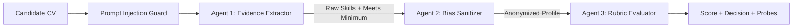

# Agentic Workflow & Design Specification

This document details the multi-agent architecture within the **Domain Copilot** system and documents the governed agentic development environment used during engineering, strictly fulfilling requirements from **FR-4**, **FR-5**, and **§6 (Agentic coding workflow)**.

---

## 1. Runtime Multi-Agent Architecture (3-Agent Pipeline)

Instead of a monolithic single prompt that burdens the LLM and risks context degradation, bias, and hallucination, Domain Copilot implements a deterministic linear pipeline consisting of three specialized agents communicating through typed contracts.

### 1.1 Agent 1: The Evidence Extractor
* **Role**: Parses unstructured candidate CVs, isolates demonstrable technical evidence, and maps them to the Job Description (JD).
* **Typed Contract**:
  - **Input**: `RawCvText`, `JobDescriptionText`.
  - **Output**: `ExtractedSkillsDto` (Extracted skills, years of experience, and a deterministic `MeetsMinimumQualifications: boolean` flag).
* **Rationale & Termination**: Cuts down token payload for subsequent downstream agents and triggers an immediate Early Exit if the candidate fails minimum hard criteria.

### 1.2 Agent 2: Bias Defense & Sanitizer
* **Role**: Enforces anti-bias compliance and data privacy boundaries.
* **Typed Contract**:
  - **Input**: `ExtractedSkillsDto`.
  - **Output**: `AnonymizedCandidateProfileDto` (Candidate profile with Name, Gender, Age, Ethnicity, and Location strictly stripped/redacted).
* **Rationale**: Sits on the trust boundary. By ensuring the Evaluator Agent never receives demographic tokens, unconscious model bias and OWASP LLM06 (Sensitive Information Disclosure) are structurally eliminated.

### 1.3 Agent 3: The Rubric Evaluator
* **Role**: Core decision-maker performing comparative evaluation against RAG-retrieved policies.
* **Typed Contract**:
  - **Input**: `AnonymizedCandidateProfileDto`, `JobDescriptionText`, `RetrievedCorpusChunks` (RAG context).
  - **Output**: `EvaluationDecisionDto` (JSON containing Score (0-100), Recommendation (HIRE/SHORTLIST/REJECT), Reasoning, and 3 InterviewProbes).
* **Rationale**: Grounds scoring against official company rubrics rather than model assumptions.

### 1.4 Orchestration & Circuit Breakers
The `ScreeningPipelineService` acts as the orchestrator. If the regex-based `PromptInjectionGuard` flags an adversarial attack, or Agent 1 flags an unqualified candidate, the pipeline executes an Early Exit, immediately persisting the rejection and saving over 60% in token consumption and runtime latency.

---

## 2. Governed Agentic Development Workflow (§6 Compliance)

As mandated by section §6 of the technical brief, AI was leveraged not as an unguided generator, but as a governed participant adhering to strict architectural boundaries. The following five controls were configured and enforced:

### 1. Project Instruction File & Architectural Guardrails
We established strict workspace rules instructing the AI assistant (Antigravity) to adhere to Clean Architecture, enforcing the constraint that the Core domain layer must never reference external LLM SDKs, web frameworks, or persistence packages.

### 2. Versioned Prompt Library as Artifacts
Prompts are treated as first-class, versioned software artifacts rather than hardcoded string literals inside C# classes. System prompts for Extractor, Sanitizer, and Evaluator reside in externalized templates, allowing systematic auditing and independent prompt regression testing.

### 3. Sub-Agents Scoped to Distinct Engineering Roles
Development tasks were delegated to scoped agent roles:
- **Architecture & Scaffolding**: Generated Clean Architecture boilerplate and MediatR handlers.
- **Security Reviewer**: Verified OWASP LLM defenses (input delimiters and regex parsers).
- **Test Harness Writer**: Generated unit tests and the evaluation execution harness (`eval/run_qa_eval.js`).

### 4. Automated Quality Gates & Circuit Breakers
The automated evaluation suite (`npm run eval:qa`) serves as a regression gate. Any code or prompt modification that drops retrieval hit-rate below 90% or breaks refusal correctness prevents deployment.

### 5. Deterministic Provider Abstraction & Fallback Chain
The development system strictly enforced provider decoupling (`IResilientLLMService`). When external API limits or internet outages occur, the environment automatically routes execution to local Ollama (Llama 3.2), ensuring uninterrupted verification and testing.
