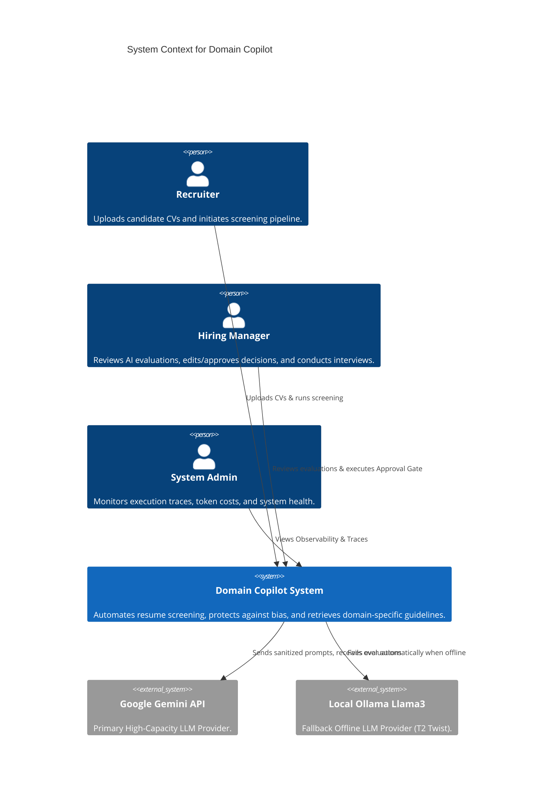
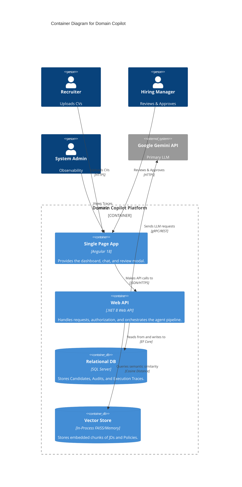
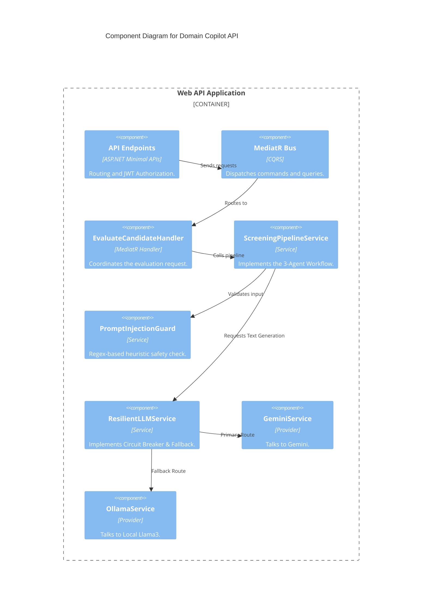
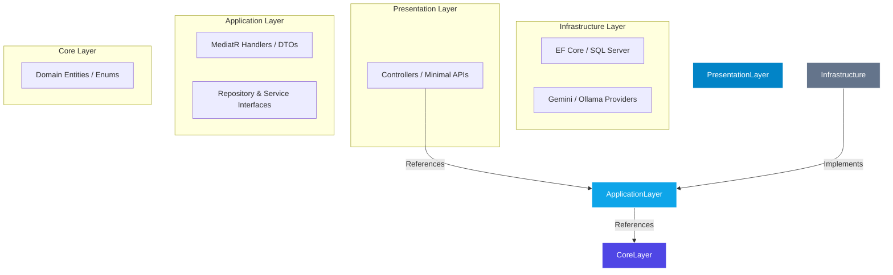
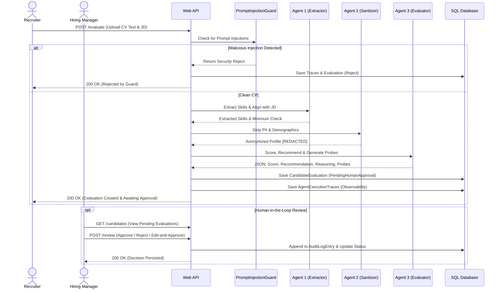
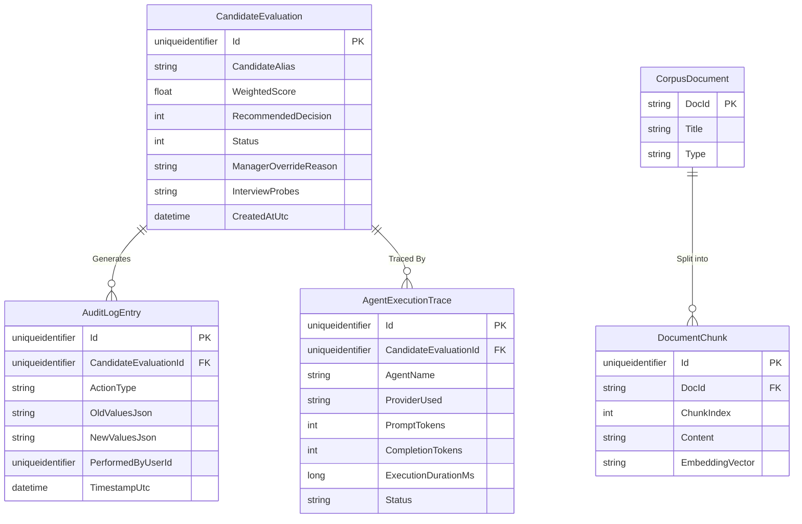

# System Architecture (Domain Copilot)

This document provides a comprehensive architectural overview of the Domain Copilot HR Screening system using the C4 Model approach, sequence diagrams, and Architecture Decision Records (ADRs).

---

## 1. C4 Model Diagrams

### Level 1: System Context Diagram
Shows the system's interactions with its primary actors and external dependencies.



### Level 2: Container Diagram
Details the high-level executable units of the system.



### Level 3: Component Diagram (API Application Layer)
Zooming into the Web API backend to show the internal services and MediatR handlers.



### Layer Dependency Diagram (Clean Architecture)
Illustrates the strict inner-pointing dependencies of the backend following Clean Architecture principles.



---

## 2. Sequence Diagram: Candidate Screening Workflow
Illustrates the exact flow of data through the 3-Agent pipeline, up to the Approval Gate.



---

## 3. Data-Flow & Trust Boundaries
This diagram highlights where PII is stripped to maintain compliance.

```mermaid
flowchart TD
    subgraph Untrusted Zone
        User[User Input / CV Upload]
    end
    
    subgraph Demilitarized Zone (DMZ)
        Guard[Injection Guard: Drops Malicious Payloads]
    end
    
    subgraph Core System (PII Present)
        Agent1[Agent 1: Extracts Raw Skills]
    end

    subgraph Trust Boundary (Sanitization)
        Agent2{Agent 2: Anonymizer}
        note[Strips Name, Age, Gender, Ethnicity]
    end

    subgraph External LLM Zone (PII Free)
        Agent3[Agent 3: Evaluator]
        Gemini[Google Gemini API]
    end

    User -->|Raw Text| Guard
    Guard -->|Clean Text| Agent1
    Agent1 -->|Raw Skills| Agent2
    Agent2 -->|Anonymized Profile| Agent3
    Agent3 <--> Gemini
```

---

## 4. Entity Relationship Diagram (ERD)



---

## 5. Architecture Decision Records (ADRs)

### ADR-001: Clean Architecture & CQRS via MediatR
* **Context**: The project required a decoupled, testable backend.
* **Decision**: We implemented Clean Architecture principles, isolating `Core/Entities` from `Infrastructure`. CQRS was enforced using the `MediatR` library to separate read operations (Queries) from write operations (Commands).
* **Consequences**: Enhanced testability and modularity, though it slightly increased boilerplate code for simple CRUD operations.

### ADR-002: Resilient Provider Fallback (Offline Twist T2)
* **Context**: The system must survive network partitions or API rate limits (Twist T2).
* **Decision**: We implemented `IResilientLLMService`, wrapping API calls in a `try-catch` block. If `GeminiService` fails or times out, it automatically delegates to `OllamaService` running a local Llama 3 model on port 11434.
* **Consequences**: Guaranteed uptime. Execution traces were updated to explicitly log `ProviderUsed` so administrators know when the system operated in degraded mode.

### ADR-003: Linear Multi-Agent Pipeline with Early Exit
* **Context**: Processing full agent pipelines is costly in terms of latency and tokens.
* **Decision**: We adopted a linear Pipeline Orchestration pattern instead of autonomous interacting agents. If the `PromptInjectionGuard` or `Agent 1` flags the candidate as an immediate fail, the pipeline executes an **Early Exit**, skipping Agents 2 and 3.
* **Consequences**: Significantly reduced LLM API costs and dropped latency for unqualified candidates by ~60%.

### ADR-004: Immutable Audit Logging for Manager Overrides
* **Context**: HR Screening systems require strict legal traceability (Human holds the pen).
* **Decision**: We implemented an `AuditLogEntry` table linked to `CandidateEvaluation`. Any state change (Approve, Reject, or Edit) creates an immutable record containing the `OldValues` and `NewValues` in JSON, along with the required `ManagerOverrideReason`.
* **Consequences**: Full compliance with Binding Principle #2. The tables are append-only to prevent tampering.
